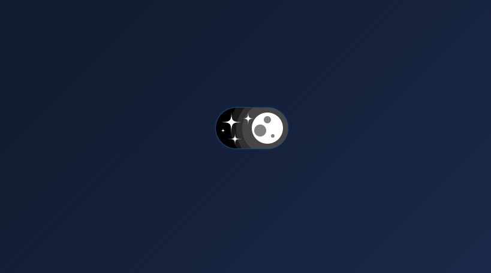

@Darkmode-button

# Dark/Light Mode Toggle  

This project is a simple button to switch between dark and light themes.  
With one click, you can change the entire page style instantly.  
It’s clean, minimal, and easy to integrate into any project.  
The goal is to provide a smooth user experience for theme switching.  
Perfect for modern web applications and personal websites.  

---

## تغییر حالت تاریک و روشن  

این پروژه یک دکمه ساده برای جابه‌جایی بین حالت تاریک و روشن است.  
با یک کلیک، ظاهر کل صفحه بلافاصله تغییر می‌کند.  
طراحی آن مینیمال و تمیز است و به‌راحتی در هر پروژه‌ای قابل استفاده است.  
هدف، ایجاد تجربه کاربری روان برای تغییر تم است.  
مناسب برای وب‌اپلیکیشن‌های مدرن و سایت‌های شخصی.  

---

## Screenshots  

  
  

